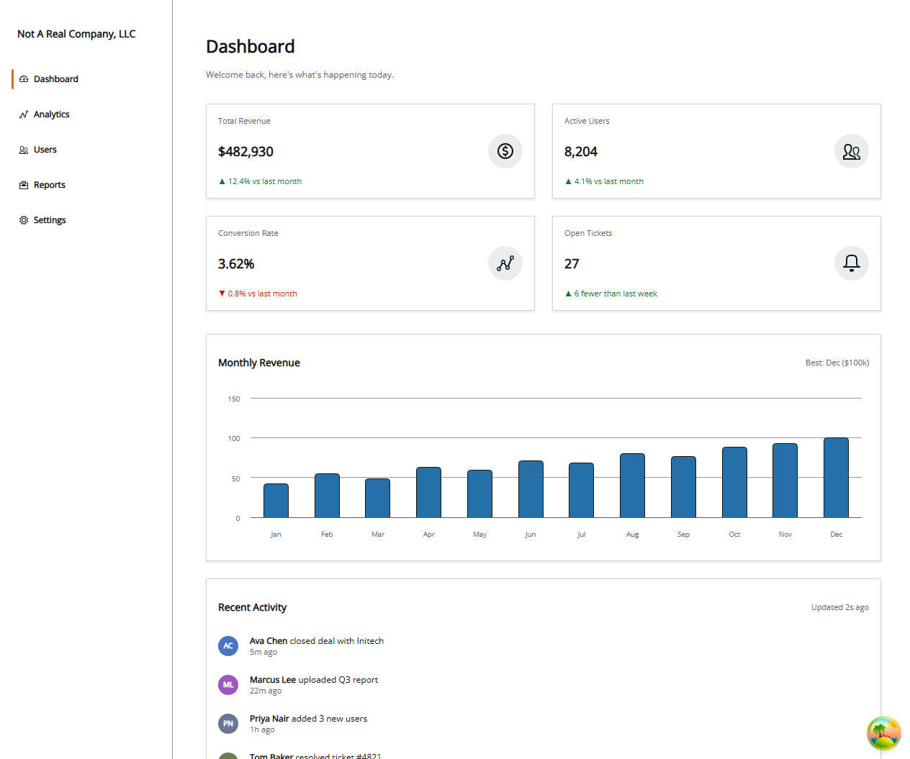
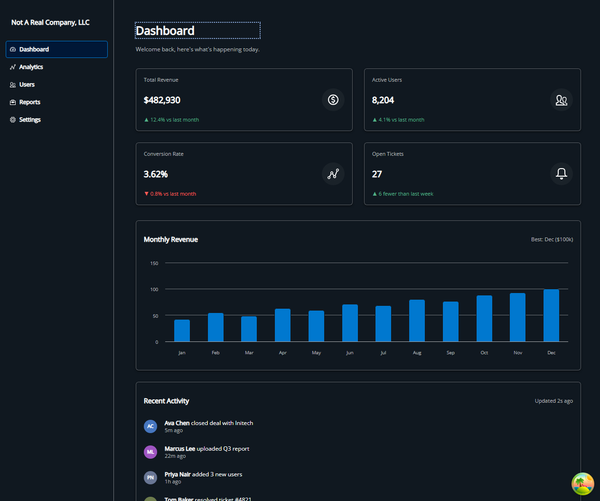

# Salt React

A small internal-dashboard app built with **React 19**, **TypeScript**, and JPMorgan's [Salt Design System](https://www.saltdesignsystem.com/), put together as a portfolio piece to demonstrate architecting a real application on top of Salt rather than just styling a few components.

All data in the app is **simulated** — the Analytics page hits a fake in-memory "backend" with artificial network latency (see [`src/api/analytics.ts`](src/api/analytics.ts)) so the loading/error/retry states are real and testable without an actual server.

<p align="center">
  
  
</p>

## Features

- **Dashboard** — stat cards, a Highcharts revenue chart, and a recent-activity feed
- **Analytics** — three chart types (line, donut, bar) each backed by its own [TanStack Query](https://tanstack.com/query) hook, with real loading spinners and a deliberately-flaky endpoint to exercise the error + retry path
- **Users** — a searchable, sortable table built on Salt's `Table` primitives (Salt has no built-in data-grid component with search/sort — this is hand-rolled on top of `Table`/`SearchInput`)
- **Reports** — a generate-report flow backed by this app's first TanStack Query **mutation** (everywhere else only reads data with `useQuery`), with a real loading state on the button, a `Toast` on success/failure, and a paginated report-history table (`Pagination`/`Paginator`) that refetches via `invalidateQueries` once generation succeeds
- **Settings** — a "Workspace" panel for theme (light/dark), density (high/medium/low/touch), and resetting the sidebar's width
- A **resizable sidebar** (drag or arrow-key resize, persisted to `localStorage`) that becomes an off-canvas drawer with a hamburger toggle below Salt's `xs` breakpoint (600px) — dragging a resizable column doesn't make sense on a phone-width screen, so it's disabled entirely there rather than left broken
- Light/dark mode and density are both real Salt theming levers (`SaltProviderNext`'s `mode`/`density` props), not just CSS
- Rounded corners and bordered, full-width sidebar navigation via `SaltProviderNext`'s `corner="rounded"`, matching [Salt's own vertical-navigation examples](https://www.saltdesignsystem.com/salt/components/vertical-navigation/examples)

## Tech stack

| | |
|---|---|
| Framework | React 19 + TypeScript, Vite |
| Design system | `@salt-ds/core` (`SaltProviderNext`), `@salt-ds/lab`, `@salt-ds/icons`, `@salt-ds/theme` |
| Charts | Highcharts via `highcharts-react-official` |
| Data fetching | TanStack Query |
| Testing | Vitest + React Testing Library |

## Getting started

Requires Node 22+.

```bash
npm install
npm run dev       # start the dev server
npm run build     # type-check + production build
npm run test      # run the test suite once
npm run test:watch
npm run lint
```

## Project structure

```
src/
  api/            simulated backend (fake latency; some endpoints fail some of the time on purpose)
  components/     shared, mostly presentational components
  components/analytics/   the three Analytics chart components
  context/        ThemeModeContext (see "Architecture notes" below)
  hooks/          custom hooks - see below
  lib/            small framework-interop shims (see the Highcharts note below)
  pages/          one component per sidebar destination
  test/           Vitest setup + shared render helpers (not test files themselves)
  __tests__/      App-level integration tests
```

Test files live in a `__tests__` folder next to what they cover (e.g. `src/hooks/__tests__/useDarkMode.test.ts`), matching the convention Salt's own repo uses.

## Custom hooks

| Hook | Purpose |
|---|---|
| `useDarkMode` | Light/dark state, persisted to `localStorage` |
| `useDensity` | Salt `density` state, persisted to `localStorage` |
| `useResizableWidth` | Drag/keyboard-resizable panel width with min/max clamping, used by the sidebar |
| `usePrevious` | Generic "what was this value last render" (`useRef` + `useEffect`) |
| `useAnalyticsQueries` | Thin wrappers around `useQuery` for the three Analytics endpoints |
| `useReportsQueries` | `useQuery` for report history, plus this app's first `useMutation` (generating a report), which invalidates the history query on success |
| `useToast` | Single-toast state with auto-dismiss, used by the Reports generate/download flows |

Each hook's source comments explain *why* it's written the way it is (e.g. why `useResizableWidth` tracks its drag state in a `ref` in addition to `useState` — a real race condition between pointer events and React's render cycle, not a hypothetical one).

## Architecture notes

- **Context, used narrowly.** `ThemeModeContext` exists so `RevenueChart` (nested two levels below `App`, inside `DashboardPage`) can read `darkMode` without `DashboardPage` — which doesn't otherwise care about the theme — having to accept and forward a prop. It's not used as a blanket alternative to props anywhere else in the app.
- **One `QueryClient`**, created once in `main.tsx` and provided at the root, same as you'd do in a real app.
- **`ChartCard`** centralizes the loading-spinner / error-plus-retry / success rendering so each Analytics chart component only deals with its own data shape.
- **`ResponsiveHighcharts`** wraps every chart with a `ResizeObserver` that calls `chart.reflow()` — Highcharts only re-measures on the browser `window`'s resize event by default, so a chart's SVG otherwise stays stale-sized when its *container* shrinks for any other reason (like the sidebar being dragged), which visibly overflowed its card until this was added.
- **Responsive nav via `useBreakpoint`**, not a hand-rolled media-query hook — it reads the same Salt breakpoint context that already drives this app's `GridLayout` responsive `columns` props, so there's one source of truth for what "mobile" means across the whole app.

## Bugs found along the way

Building this surfaced a few real upstream issues, fixed and documented in place rather than worked around silently:

- **`@salt-ds/core@1.68.0` / `@salt-ds/lab` currently depend on `@salt-ds/icons@^1.18.2`, which was never published to npm** (`1.18.0` is latest). Pinned to the last mutually-compatible version set in `package.json` instead.
- **`VerticalNavigationItemTrigger`'s hover overlay has no positioned ancestor** in this Salt version, so it expands to cover the entire nav list instead of just its own row — only the last nav item ever received clicks. Fixed with one CSS rule (`src/App.css`).
- **`highcharts-react-official`'s UMD build isn't statically analyzable by esbuild's CJS→ESM interop**, so a plain default import resolves to the whole module's exports object instead of the component. `src/lib/HighchartsReact.ts` unwraps it once for every chart to reuse.
- **`corner="rounded"` (and the other `SaltProviderNext`-only theming props) render as a no-op if you import `@salt-ds/theme/index.css`** — that's the legacy bundle, and it ships zero `[data-corner]` CSS rules in any published version. The fix is importing `@salt-ds/theme/css/global.css` + `@salt-ds/theme/css/theme-next.css` instead (`src/main.tsx`).
- **`VerticalNavigationItemContent` doesn't stretch to fill its trigger's width**, and the trigger's own vertical padding leaves a visible gap between consecutive items — neither matches Salt's own docs examples, where bordered nav items span the full row and sit flush against each other. Two targeted CSS rules in `src/App.css` fix both.
- **CSS Grid items default to `min-width: auto`**, so they won't shrink below their content's natural size — combined with the stale-Highcharts-width issue above, a chart card's oversized SVG could inflate its *entire shared grid track* and drag a neighboring card (like Recent Activity, which has no oversized content of its own) into overflow right along with it. Fixed alongside the `ResponsiveHighcharts` reflow fix as belt-and-suspenders.
- **`Pagination` renders an empty `<nav>` with no children of its own** — it's a context provider, not a self-contained control; it expects a `<Paginator />` (or hand-rolled page buttons reading from its context) passed in as a child. Passing `count`/`page`/`onPageChange` alone silently renders nothing.

## Testing

Vitest + React Testing Library, run against `jsdom`. A few polyfills were needed in `src/test/setup.ts` for gaps in this jsdom/Node combination — none of them are Salt- or app-specific:

- `localStorage` (genuinely `undefined` in this environment — polyfilled with a minimal in-memory `Storage`)
- `matchMedia`, `ResizeObserver` (used by Salt's theme/breakpoint code)
- `CSS.supports` (checked by Highcharts at module-load time)

Coverage focuses on things with actual logic to break: every custom hook, the simulated API layer (including the flaky-endpoint and retry-disabled paths), interactive components (`ChartCard`'s three states, `Sidebar` navigation and its mobile-drawer behavior, `ResizeHandle`, `ToastNotification`), the `Users` page's search/sort behavior, the `Reports` page's generate/error/pagination/download behavior (mocking the API layer directly rather than waiting out real simulated latency), and `App`-level navigation/focus/title behavior. Purely presentational chart-wiring components aren't unit tested — that would mostly be re-testing Highcharts, not this codebase.
